# 🧠 VeriModel: Decentralized AI Model Benchmark & Verifiable Evaluation Escrow Protocol

[](https://opensource.org/licenses/MIT)
[](https://docs.genlayer.com)
[](https://github.com/genlayerlabs)
[-00f5a0.svg)](#-test-suite--verification)

**VeriModel** is a decentralized, intelligent milestone evaluation and bounty escrow protocol built natively on GenLayer. It solves the reproducibility and benchmark contamination crisis in open-weight AI research by conditioning grant/prize disbursements on **decentralized multi-validator neural consensus over live authority leaderboard telemetry** (HuggingFace Open LLM Leaderboard API, LMSYS Chatbot Arena, OpenRouter, and Weights & Biases).

---

## 🎯 The Web3 & AI Problem: Benchmark Contamination & Fake Evals

As DAOs, research foundations, and decentralized compute networks distribute millions in grants and bounties for open-weight AI models, they face a critical dilemma:
- **Benchmark Contamination & Overfitting**: AI models frequently overfit to public test sets or report fabricated benchmark metrics (HumanEval, MMLU, GSM8K) in non-reproducible environments.
- **Unbonded AI Grant Claims**: Grant sponsors disburse funding upfront, leaving zero recourse if the delivered open-weights model fails independent evaluation.
- **Traditional Oracles Cannot Parse AI Evals**: Scalar price oracles (Chainlink) cannot parse unstructured HuggingFace eval trees, LMSYS Arena ELO rankings, or JSON benchmark harnesses.

### 💡 Why GenLayer is Central to VeriModel
GenLayer provides the only execution layer capable of evaluating off-chain AI benchmark reproducibility:
1. **Live Authority Leaderboard Telemetry Grounding (`gl.nondet.web.get`)**: Validators independently retrieve real-time eval metrics from committed endpoints (`huggingface.co/api`, `lmarena.ai`, `openrouter.ai`).
2. **Multi-Validator Neural Consensus (`gl.vm.run_nondet_unsafe`)**: Validators analyze benchmark scores against contracted specifications under the **Equivalence Principle** with strict canonical action decisions.
3. **Deterministic Slashing & Exact Payout Preservation**: Slashes developer collateral upon proven benchmark falsification or awards the bounty prize upon verified reproducibility with zero financial drift.

---

## 🏛️ Exact Payout Preservation & Canonical Action Consensus

To eliminate numeric drift and ambiguous threshold crossings, VeriModel enforces **Canonical Action Decisions**:

| Canonical Action Decision | Validation Criteria | On-Chain Execution |
|---|---|---|
| **`RELEASE_BOUNTY`** | `benchmark_achieved == True` AND `confidence_score >= 80` | Releases bounty prize + stake refund to Developer (`emit_transfer(bounty + stake)`) |
| **`SLASH_CHALLENGE`** | Falsified evals / contaminated benchmark / failed scores | Slashes developer stake + refunds bounty to Sponsor (`emit_transfer(bounty + stake)`) |
| **`EXTEND_EVAL_WINDOW`** | In-progress eval runs (`confidence_score < 80`) | Challenge remains active for retry; zero funds released |

### Key Security & Solvency Invariants:
1. **🗓️ Fail-Closed Runtime Block Timing**: Timestamps are strictly derived from enforceable GenLayer runtime block state (`_get_runtime_timestamp()`). Unavailable timestamps strictly fail closed.
2. **🌐 Strict Authority Host Whitelist (SSRF Hardened)**: Exact hostname extraction neutralizes subdomain, query, and path spoofing (e.g., `huggingface.co.attacker.com` is strictly rejected).
3. **🔒 Committed Source Adjudication Binding**: Adjudication is strictly bound to the target leaderboard URL committed on-chain during challenge creation. Callers cannot substitute uncommitted URLs.
4. **📡 Fail-Closed HTTP 200-299 Status Validation**: Telemetry responses missing explicit status or returning non-2xx status codes fail closed immediately.
5. **🏦 100% Solvency Invariant**: Tracks total active liabilities (`total_active_liabilities`) and prevents over-allocation.

---

## 🏛️ System Architecture

```mermaid
sequenceDiagram
    autonumber
    actor Sponsor as 🏛️ AI Grant Sponsor / DAO
    participant VeriModel as 🧠 VeriModel (GenVM)
    actor Dev as 🧑‍💻 AI Model Developer
    participant Validators as ⚖️ GenLayer Validators (Optimistic Democracy)
    participant Web as 🌐 Authority Leaderboard (HuggingFace / LMSYS)

    Sponsor->>VeriModel: create_challenge(dev, "CODING_HUMANEVAL", spec, committed_url, stake) + deposit 100 GEN
    Note over VeriModel: Locks 100 GEN bounty & commits leaderboard endpoint with strict host validation
    Dev->>VeriModel: stake_and_enter_challenge(chal_id) + deposit 30 GEN stake
    Note over VeriModel: Challenge status = ACTIVE (Total 130 GEN locked)
    
    Dev->>VeriModel: adjudicate_benchmark(chal_id, notes, committed_url)
    
    rect rgb(15, 23, 42)
        Note over VeriModel,Validators: Non-Deterministic Multi-Validator Consensus
        Validators->>Web: gl.nondet.web.get(committed_url)
        Validators->>Validators: gl.nondet.exec_prompt(Evaluate benchmark scores & reproducibility)
        Validators->>Validators: Equivalence Principle Check (Canonical Action Match & Non-Crossing Threshold)
    end

    alt Benchmark Verified (Confidence >= 80)
        VeriModel->>Dev: emit_transfer(130 GEN) [Bounty Prize + Stake Refund]
    else Falsified Evals / Failed Thresholds
        VeriModel->>Sponsor: emit_transfer(130 GEN) [Bounty Refund + Slashed Developer Stake]
    else In-Progress Evaluation
        VeriModel->>VeriModel: status = ACTIVE (Evaluation window extended for retry)
    end
```



---

## 📁 Repository Structure

```
verimodel-protocol/
├── contracts/
│   └── verimodel.py           # Core Intelligent Contract on GenVM
├── frontend/
│   ├── index.html             # Glassmorphic DApp UI with live genlayer-js client
│   └── client.ts              # TypeScript GenLayer client integration SDK
├── tests/
│   ├── direct/
│   │   └── test_verimodel.py  # 100% Passing in-memory direct VM test suite (7 scenarios)
│   └── integration/
│       └── test_verimodel_integration.py # StudioNet / RPC deployment integration tests
├── pytest.ini                 # Pytest direct suite collection configuration
├── gltest.config.yaml         # GenLayer Testnet/StudioNet network configuration
├── package.json               # genlayer-js & development dependencies
├── requirements.txt           # Python dependencies (genlayer, pytest)
└── README.md                  # Complete architectural & technical documentation
```

---

## 💻 Frontend & GenLayer Client Integration

The included interactive DApp (`frontend/index.html`) is connected to the real **`genlayer-js@1.2.0`** client, enabling full on-chain lifecycle management:

1. **Wallet / Account Management**: Auto-generates testnet keypairs or imports custom private keys.
2. **Multi-Network Support**: Switch seamlessly between **GenLayer Bradbury Testnet (4221)**, **StudioNet (4222)**, and **LocalNet**.
3. **Bounty Challenge Deployment**: Create challenges, define verifiable score targets, and commit to authority endpoints (`create_challenge`).
4. **Developer Staking**: Deposit collateral bonds to activate challenges (`stake_and_enter_challenge`).
5. **Live Neural Adjudication**: Trigger multi-validator consensus over live authority leaderboards (`adjudicate_benchmark`).
6. **Live Contract State Queries**: Dynamically reads `get_challenge` and `get_protocol_stats` with explorer links.

### TypeScript Client Example (`frontend/client.ts`):

```typescript
import { getGenLayerClient, createChallenge, stakeAndEnterChallenge, adjudicateBenchmark, getChallenge } from './frontend/client';

const client = getGenLayerClient('0xYourPrivateKey...');
const contractAddress = '0xB8e1c3559B66B1b1d7d0823FBEB5A967732e999';

// 1. Sponsor creates 7-day Coding Benchmark Challenge (100 GEN bounty, 30 GEN required developer stake)
const tx1 = await createChallenge(
  client,
  contractAddress,
  '0xModelDeveloper...',
  'CODING_HUMANEVAL',
  'HumanEval pass@1 >= 80.0%, MBPP >= 75.0%',
  'https://huggingface.co/api/models/open-llm-leaderboard/evals/deep-coder-v2',
  30, // Required stake
  86400 * 7,
  100 // Bounty deposit
);

// 2. Developer stakes 30 GEN collateral to activate challenge
const tx2 = await stakeAndEnterChallenge(client, contractAddress, 0, 30);

// 3. Trigger Benchmark Adjudication on committed leaderboard telemetry
const tx3 = await adjudicateBenchmark(client, contractAddress, 0, 'Official HF run completed (84.6% HumanEval)', 'https://huggingface.co/api/models/open-llm-leaderboard/evals/deep-coder-v2');

// 4. Query Final On-Chain State
const chal = await getChallenge(client, contractAddress, 0);
console.log(`Status: ${chal.status}, Verdict: ${chal.adjudication_verdict}, Confidence: ${chal.adjudication_confidence}%`);
```

---

## 🧪 Test Suite & Verification

Run the complete direct test suite:

```bash
pytest
# or
pytest tests/direct/ -v
```

### Verified Test Scenarios (7 Tests):
1. `test_benchmark_success_and_bounty_release`:
   - Sponsor creates challenge with 100 GEN bounty. Developer deposits 30 GEN stake.
   - Live telemetry proves 84.6% HumanEval (>80% target).
   - Consensus on `RELEASE_BOUNTY` (conf: 96) -> 130 GEN released to Developer.
2. `test_benchmark_falsification_slashing` (Adversarial):
   - Developer submits falsified/contaminated benchmark (52.4% vs 80% target).
   - Consensus on `SLASH_CHALLENGE` (conf: 98) -> 130 GEN awarded to Sponsor.
3. `test_in_progress_eval_grace_period_extension`:
   - Queued or in-progress runs trigger `EXTEND_EVAL_WINDOW` without releasing funds.
4. `test_mismatched_leaderboard_url_reverts` (Adversarial):
   - Reverts when caller attempts to submit an uncommitted URL during adjudication.
5. `test_untrusted_domain_spoofing_reverts` (Adversarial):
   - Rejects hostname substring spoofing attempts (e.g. `huggingface.co.attacker.com`).
6. `test_unauthorized_early_release_reverts` (Fail-Closed):
   - Verifies active challenges cannot be released before expiration.
7. `test_non_developer_stake_reverts` (Access Control):
   - Enforces that only the designated developer can deposit collateral.

---

## 📄 License

MIT © [Lesnak1](https://github.com/Lesnak1) & GenLayer Community
